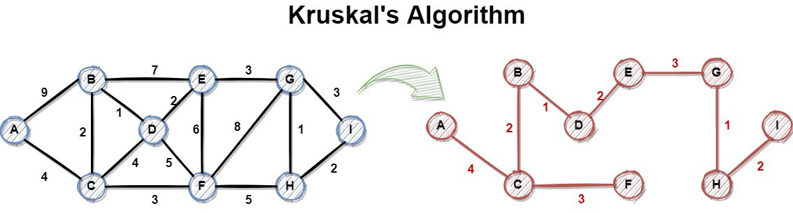

<h1 align="center">
    <a href="https://python.plainenglish.io/an-introduction-to-kruskals-algorithm-theory-and-python-implementation-6117c164fbc6">
        
    </a>
</h1>

## Descrição

Este trabalho de Inteligência Artificial tem por objetivo demonstrar a utilização do **Algoritmo de Kruskal**, em que é gerada uma **árvore geradora mínima** a partir de um grafo complexo, a fim de otimizar algoritmos de buscas mais simples. Os seguintes algoritmos foram utilizados:

- Algoritmo de Kruskal
- Busca em Largura _(Breadth-first search)_
- Busca em Profundidade _(Depth-first search)_

## Pré-requisitos

- [**Python v3.9.4**](https://www.python.org/downloads/release/python-394/)
- [**Git**](https://git-scm.com/)

## Como usar

1. **Clone o projeto e acesse a pasta src**

```bash
git clone https://github.com/EduardoReisUX/kruskal-ia && cd kruskal-ia/src
```

2. **Executar o programa**

```bash
python main.py
```

ou

```bash
python3 .\main.py
```

3. **Pronto, navegue pelo menu do programa.**
